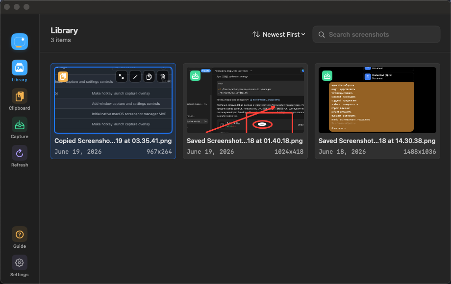
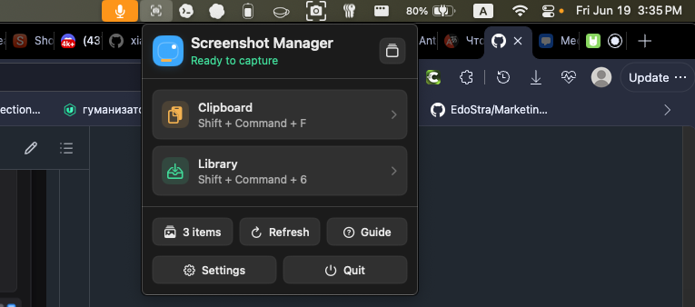
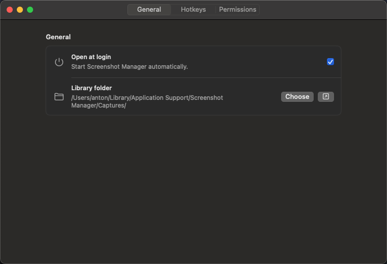
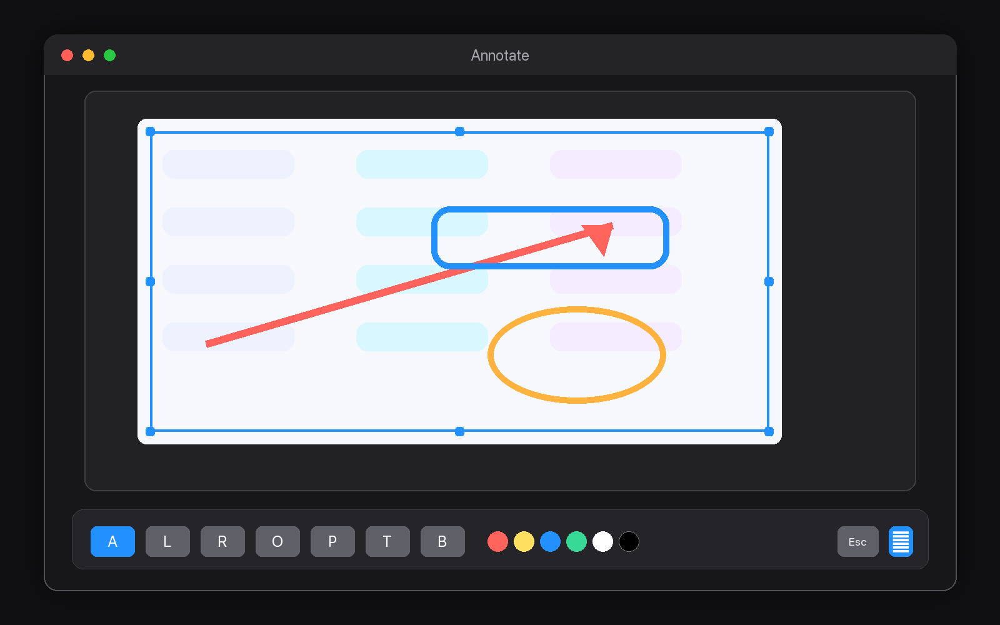

# Screenshot Manager

[English](README.md) · [Русский](README.ru.md) · [简体中文](README.zh-CN.md)

一款原生 macOS 截图管理工具，支持快速截图、标注、剪贴板工作流和本地截图图库。



## 功能

- 全局快捷键：截图到剪贴板或保存到图库
- 支持区域截图和窗口截图的捕获浮层
- 流畅的标注编辑器，支持裁剪、调整大小、箭头、形状、画笔、文字、模糊和背景样式
- 在截图浮层中查看颜色和鼠标位置坐标
- 以剪贴板为中心的快速截图流程
- 可选的本地图库保存流程
- 可搜索的本地截图图库
- 快速预览、复制、编辑、在 Finder 中显示和删除
- OCR 文本识别，并支持复制识别出的文字
- 原生设置窗口，可配置快捷键、权限、开机启动和菜单栏图标显示
- 本地优先设计，不包含遥测

## 截图

| 图库 | 菜单栏 |
| --- | --- |
|  |  |

| 设置 | 编辑器 |
| --- | --- |
|  |  |

## 系统要求

- macOS 14 或更高版本
- 本地构建需要 Xcode 16 或更高版本
- 截图功能需要 Screen Recording 权限

部分功能，例如文本识别，使用 macOS 提供的原生 Apple frameworks。

## 构建

可以在 Xcode 中打开 `ScreenshotManager.xcodeproj`，也可以在终端中运行：

```bash
xcodebuild -project ScreenshotManager.xcodeproj -scheme ScreenshotManager -configuration Debug build
```

## 安装本地 Debug 版本

辅助脚本会构建应用，将其安装到 `/Applications/Screenshot Manager.app`，使用本地开发证书签名并打开应用：

```bash
./scripts/install-debug-app.sh
```

这样 macOS 隐私权限会绑定到已安装的应用，而不是随机的 DerivedData 构建产物。

## 创建 DMG

```bash
./scripts/build-dmg.sh
```

生成的 DMG 文件位于：

```text
dist/Screenshot Manager.dmg
```

如果要公开分发，请使用 Apple Developer ID certificate 对应用进行签名和 notarize。仓库中的本地签名辅助脚本仅用于开发构建。

## 权限

Screenshot Manager 需要 Screen Recording 权限才能捕获屏幕。应用会在开始截图前检查权限，如果未授权，会打开对应的 System Settings 页面。

## 隐私

截图保存在本地。应用不包含分析、遥测、远程日志记录或截图上传代码。

## 许可证

MIT License。请参阅 [LICENSE](LICENSE)。
